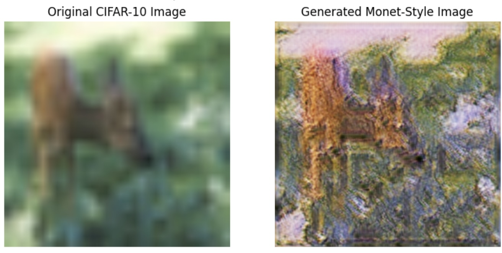
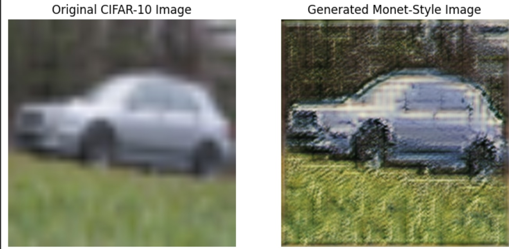
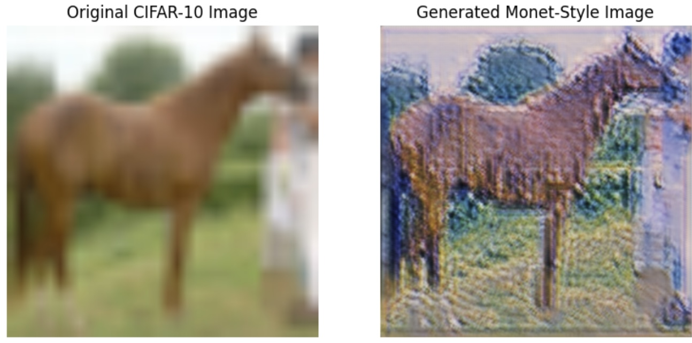
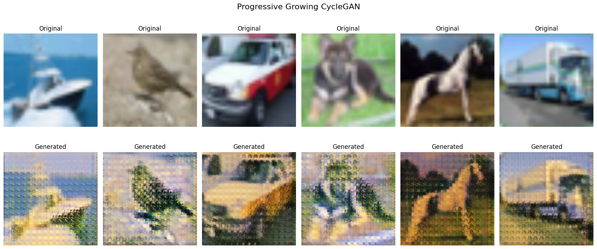
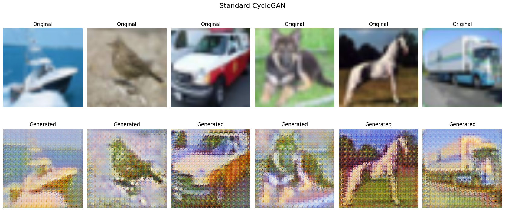

[](https://github.com/Mu-niu13/Image-Translation-CycleGAN/actions/workflows/ci.yml)

# Progressive Growing CycleGAN For High-Resolution Image Translation

Welcome to the Progressive Growing CycleGAN repository! This project explores an integration of CycleGAN with Progressive Growing GANs for high-resolution image-to-image translation. By combining these methods, we aim to achieve superior translation stability and fidelity when working with unpaired datasets.

<div style="display: flex; justify-content: space-between;">
    
    
    
</div>


## Overview

This project aims to transform CIFAR-10 images into Claude Monet-inspired artworks by leveraging Progressive Growing CycleGAN, a method that incrementally scales image resolution and addes layers during training. The progressive approach enables the model to first capture coarse features and gradually refine high-resolution details, ensuring smoother, Monet-like textures and more stable training.

## Features

- **Progressive Resolution Scaling:** The model starts training at a low resolution (e.g., 16x16) and gradually increases to 512x512, allowing stable learning at each stage.
- **Improved Image Fidelity:** Enhanced generation quality with smoother transitions, natural brushstroke textures, and coherent Monet-like aesthetics.
- **Comprehensive Evaluation:**
  1. Quantitative metrics:
    - Fréchet Inception Distance (FID)
    - Inception Score (IS)
  2. Qualitative visual comparisons.
- **Baseline Comparison:** Compared against the standard CycleGAN model for a fair evaluation.


## Datasets
1. Source Domain: CIFAR-10 dataset, which contains diverse classes of natural images.
2. Target Domain: Claude Monet's artworks, sourced from [UC Berkeley's official CycleGAN datasets](https://efrosgans.eecs.berkeley.edu/cyclegan/datasets/).

Both datasets are resized dynamically during training to match the current resolution stage.


## Key Results


- **Quantitative**: The proposed method achieves lower FID, indicating better alignment with the Monet style.

| **Model**                    | **FID**    | **Inception Score** |
|------------------------------|------------|---------------------|
| Progressive Growing CycleGAN | **270.42** | **4.41**            |
| Standard CycleGAN            | 273.09     | 4.43                |


- **Qualitative**: Outputs are visually more refined and stylistically accurate.






## Installation

1. Clone the repository:
   ```bash
   git clone https://github.com/your-repo-name/Progressive-Growing-CycleGAN.git
   cd Progressive-Growing-CycleGAN
   ```

2. Create a Python virtual environment and Install dependencies:
   ```bash
   make env
   ```


## Repository Structure

```
Progressive_Growing_CycleGAN/
├── README.md
├── requirements.txt
├── notebook/
│   ├── Progressive_Growing_CycleGAN.ipynb
│   ├── Standard_CycleGAN.ipynb
|   ├── main.ipynb
├── lib/
│   ├── models.py
│   ├── losses.py
│   ├── datasets.py
│   ├── train.py
│   ├── utils.py
├── .github/workflows
|   ├── ci.yml
├── data/monet
|   ├── *.jpg
├── .gitignore
├── Makefile
├── Report.pdf
├── img
|   ├── *.jpg
```


## Limitations and Future Work

- **High Computational Demand**: Progressive resolution scaling requires significant computational resources for higher resolution images.
- **Source Domain Compatibility**: Starting with datasets more visually aligned with Monet's thematic style could further enhance performance.

Future directions include:
- Optimizing computational efficiency with adaptive resolution scheduling.
- Experimenting with higher resolutions (beyond 512x512) for even finer outputs.


## References

1. Tero Karras, Timo Aila, Samuli Laine, and Jaakko Lehtinen. *Progressive growing of GANs for improved quality, stability, and variation.* [arXiv preprint arXiv:1710.10196](https://arxiv.org/abs/1710.10196), 2017.

2. Jun-Yan Zhu, Taesung Park, Phillip Isola, and Alexei A. Efros. *CycleGAN datasets.* [https://efrosgans.eecs.berkeley.edu/cyclegan/datasets/](https://efrosgans.eecs.berkeley.edu/cyclegan/datasets), 2017a.

3. Jun-Yan Zhu, Taesung Park, Phillip Isola, and Alexei A. Efros. *Unpaired image-to-image translation using cycle-consistent adversarial networks.* [arXiv preprint arXiv:1703.10593](https://arxiv.org/abs/1703.10593), 2017b.


## Citation

If you use this code or method in your work, please cite the report:

```
@misc{niu2024progressivecyclegan,
  author       = {Mu Niu and Hongyi Duan},
  title        = {Progressive Growing CycleGAN for High-Resolution Image Translation},
  year         = {2024}
}
```